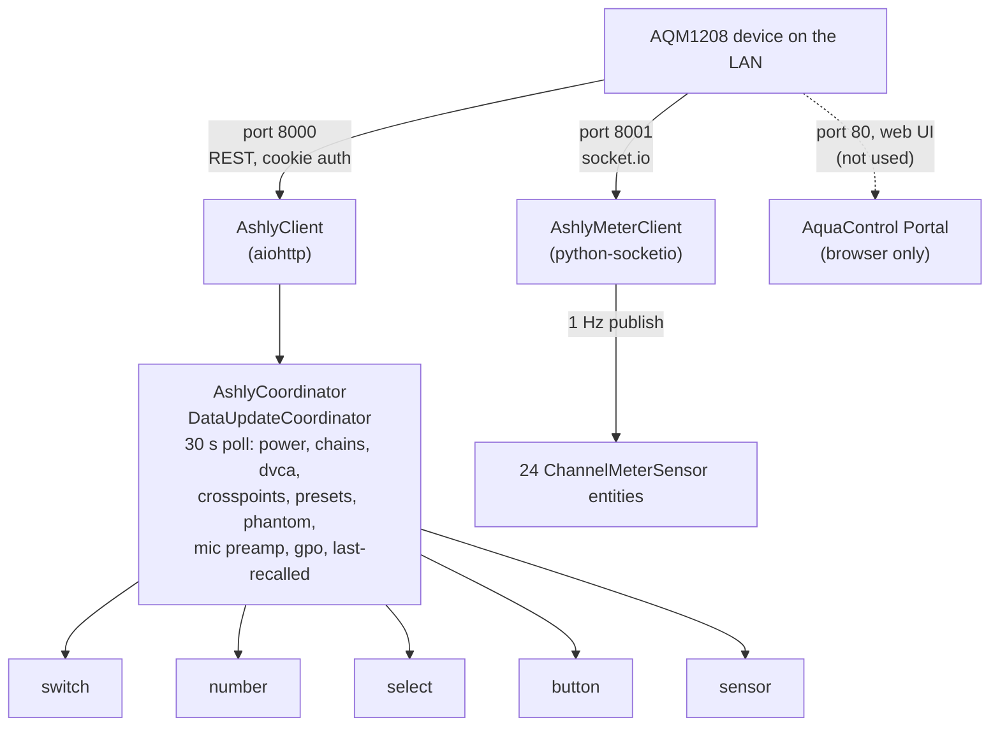

# Ashly Audio Integration for Home Assistant

[](https://hacs.xyz/)

Home Assistant custom integration for **Ashly AquaControl Zone Series**
mixers — primarily the **AQM1208** (12 in × 8 out) but the API surface is
identical across the AQM family (AQM408, etc.) and the integration is
designed to scale to multiple devices on the same LAN.

Communicates with the device's **AquaControl REST API** (cookie-authenticated,
port 8000) for control and configuration, plus the **socket.io 4.x stream**
on port 8001 for live signal-level meters.

---

## Features

### Control & state
- **Power** (front-panel power switch)
- **Front-panel LEDs** (config toggle)
- **Per-channel chain mutes** — 12 inputs + 8 outputs
- **Output → mixer assignment** — pick which mixer feeds each of the 8 outputs
- **DCA group level + mute** — 12 virtual DCAs
- **Mixer crosspoint level + mute** — full 8 × 12 matrix (disabled by default)
- **Phantom power** per mic input
- **Mic preamp gain** per mic input (0–66 dB, 6 dB steps)
- **GPO outputs** — drive the 2 rear-panel logic-output pins

### Live signal metering (via websocket)
- **24 signal-level sensors** per device — 12 rear-panel input meters
  (post-preamp) + 12 mixer-input meters (post-DSP)
- Streamed over the AquaControl socket.io endpoint on port 8001 at ~6 Hz,
  throttled to 1 Hz updates
- Disabled by default; enable per-channel from the entity settings

### Diagnostics
- **Firmware version** sensor
- **Preset count** sensor (with full list as attribute)
- **Last recalled preset** sensor
- **Identify** button (blinks the device's COM LED)
- HA **diagnostics download** with credentials / MAC / host redacted

### Lifecycle
- **DHCP auto-discovery** via the Ashly MAC OUI prefix (00:14:AA)
- **Multi-device support** — each AQM gets its own config entry
- **Reauth** flow when credentials fail
- **Reconfigure** flow for IP / port / credential changes
- **Options flow** — configurable polling interval (10–300 s, default 30 s)

---

## Supported Devices

| Model    | Inputs       | Outputs     | Verified |
|----------|--------------|-------------|----------|
| AQM1208  | 12 mic/line  | 8 balanced  | ✅ firmware 1.1.8 |
| AQM408   | 4 mic/line   | 8 balanced  | ⚠️ same API surface; not verified live |

If you have an AQM408 or another AquaControl Portal 2.0 device, please open
an issue with a diagnostic dump — the integration should work as-is but the
entity counts will need to be made model-aware.

---

## Installation

### Before you start

You'll need:

- **Home Assistant 2024.12.0 or newer.** Verify under **Settings → About**.
- **HACS** already installed in your Home Assistant. If you don't have
  HACS yet, follow the official [HACS installation
  guide](https://www.hacs.xyz/docs/use/download/download/) first, then
  come back here. (Or use the **Manual** install path below.)
- **The device's IP address.** Find it on the AQM's front panel
  (Menu → Network), or look up the lease in your router's DHCP table.
  Write it down — you'll need it during setup.
- **The device's admin password.** The factory default is `secret`
  (username `admin`). If you've changed it via the AquaControl Portal,
  use the new value. If you haven't changed it, this integration will
  raise a repair issue prompting you to — the device controls audio for
  whatever room it's in, so leaving factory creds on it is a real risk.
- **Network reachability.** Home Assistant must be able to reach the
  AQM on TCP ports **8000** (REST API) and **8001** (live-meter
  socket.io stream). If HA and the device live on different VLANs,
  this means firewall rules to permit the traffic — see [Known
  limitations](#known-limitations) for details on why mDNS / DHCP
  auto-discovery can't cross VLANs.
- **Recent AquaControl Portal 2.0 firmware** on the device. The
  integration is verified live against firmware **1.1.8**; older
  firmware that lacks the `v1.0-beta` REST API isn't supported and
  will fail setup with a "Device returned no MAC address" abort.

### HACS (recommended)

1. Open HACS in your Home Assistant instance (**HACS** in the sidebar).
2. Top-right ⋮ → **Custom repositories**.
3. Add `https://github.com/limecooler/ha-ashly-aqm` with category
   **Integration**, then click **Add**.
4. Search for **Ashly Audio** in the HACS integration list and click
   **Download** → **Download** again to confirm.
5. **Restart Home Assistant** (Settings → System → ⋮ → Restart Home
   Assistant).
6. **Settings → Devices & Services → Add Integration** → search for
   **Ashly Audio** → click it.
7. On the setup form, enter the host (IP from the prereqs), keep port
   `8000` and username `admin` unless you've changed them, and enter
   the device password. See [Configuration](#configuration) for a
   field-by-field reference.
8. **Verify the install:** the integration tile should now appear under
   **Settings → Devices & Services** with `1 device` and `~80 entities`
   visible. Click into the tile, then **Configure** if you want to
   change the polling interval; otherwise you're done.

### Manual

For users who don't run HACS, or want to test a branch/commit directly.

1. Download the latest release ZIP from
   [Releases](https://github.com/limecooler/ha-ashly-aqm/releases), or
   `git clone https://github.com/limecooler/ha-ashly-aqm.git`.
2. Copy the `custom_components/ashly/` directory into your Home
   Assistant config directory at `config/custom_components/ashly/`
   (create `custom_components/` if it doesn't exist).
3. **Restart Home Assistant.**
4. **Settings → Devices & Services → Add Integration** → search for
   **Ashly Audio** → continue with steps 7–8 from the HACS install
   above.

### If setup fails

- **"Could not connect"** — usually a network issue. Confirm Home
  Assistant can reach the device by running `ping <ip>` from the host
  HA runs on. If you're on a different VLAN, make sure the firewall
  allows TCP 8000 + 8001. Don't enter a URL into the Host field —
  just the IP or hostname.
- **"Authentication failed"** — wrong username/password. If you've
  forgotten the password, factory-reset the AQM via its front panel
  and try `admin` / `secret`.
- **"Device returned no MAC address"** — old firmware. Update via the
  AquaControl Portal and retry.
- **Anything else** — open a [bug report](https://github.com/limecooler/ha-ashly-aqm/issues/new/choose)
  with the diagnostics download (Settings → Devices & Services →
  Ashly Audio → ⋮ → **Download diagnostics**). Sensitive fields
  (password, host, MAC) are auto-redacted.

### Removing the integration

Standard HA removal flow; no manual cleanup required.

1. **Settings → Devices & Services → Ashly Audio** → ⋮ → **Delete**.
   Home Assistant unloads the integration, closes the device session
   and the live-meter socket, clears any open repair issues, and
   removes the device and all its entities from the registry. No state
   remains on disk.
2. (Manual install only) Delete `custom_components/ashly/` from your
   HA config directory and restart.
3. (HACS install) HACS → **Ashly Audio** → ⋮ → **Remove**.

The Ashly device itself is unaffected — its on-device presets, mixer
state, and authentication credentials remain untouched.

---

## Use cases

Concrete things people actually do with this integration:

- **Zone paging from automations** — Trigger an Apple Music / Sonos /
  TTS announcement, then use a `switch.turn_off` on the relevant chain
  mute switches to unmute the corresponding zones for the duration of
  the announcement, then re-mute.
- **Time-of-day preset recall** — Use the `ashly.recall_preset` service
  on an HA scheduler (e.g. `time_pattern` trigger or Schedule helper) to
  switch the venue from "Lunch", "Happy Hour", "Evening", "Late Night"
  presets without anyone touching the rack.
- **Meeting-room "default state"** — A single tap on a Lutron / Hue /
  Z-Wave keypad recalls a preset that mutes mics, drops zone levels,
  and reassigns mixer routing — all via one service call.
- **Phantom-power safety interlock** — Wire a `switch.turn_off` on the
  `phantom_power_*` switches into an automation that fires when any
  channel mute changes to `off` outside of business hours, to avoid the
  classic "pop" when a mic is hot-plugged.
- **Live-meter dashboard** — Enable a handful of the disabled-by-default
  meter sensors and put them on a Lovelace gauge / history graph for an
  at-a-glance health view of the room's audio chain.
- **Preset-recall notification** — Use the **Last recalled preset**
  sensor as a trigger to push a notification ("the system was switched
  to 'Sound Check' at 14:32") to the AV operator's phone.

---

## How data is refreshed

The integration uses two complementary update paths:

1. **REST polling (most state).** A `DataUpdateCoordinator` polls the
   device's REST API on the configured interval (default 30 s; 10–300 s
   via the integration options). One poll fetches the front panel,
   chain state, DCA state, crosspoints, presets, phantom-power state,
   mic-preamp gains, GPO state, and last-recalled preset — concurrently.
   Entities go `unavailable` when the poll fails and recover on the next
   successful poll, with a single log line per transition.

2. **Live socket.io stream (meters only).** The 24 channel-meter
   sensors are pushed from the device over a long-lived socket.io 4.x
   connection on a separate port. Updates fire at roughly 1 Hz when a
   channel has signal; the sensors are disabled by default to keep the
   recorder DB sane.

Optimistic updates: when you toggle a mute or change a level via HA,
the integration applies the change locally first and then writes to the
device, so the UI feels instant. The next poll reconciles state in case
the write didn't actually land.

---

## Known limitations

- **Supported models.** Only the AQM1208 (12-in / 8-out) and AQM408
  (8-in / 8-out) are tested. The integration may work on other AQM-
  family devices that expose the same AquaControl REST API but the
  default entity counts assume 12 inputs / 8 outputs / 8 mixers — open
  an issue with a diagnostic dump if you have a different model.
- **Reachable port.** The device must be reachable on the configured
  port (default 8000) for both the REST poll and config flow, and on
  port 8001 for the meter socket.io stream.
- **Cross-VLAN discovery.** Both DHCP and mDNS/zeroconf discovery only
  fire on the same L2 segment as Home Assistant. In typical AV-rack
  deployments the AQM lives on a separate VLAN — discovery won't see
  it without a Bonjour/DHCP reflector on the router. Use the manual
  setup flow; once the entry exists, all functionality works fine
  across VLANs.
- **No firmware update from HA.** This integration does not push
  firmware to the device. Updates are done from Ashly's standalone
  AquaControl Portal.
- **Crosspoint mutes/levels are disabled by default.** 96 of each per
  AQM1208 would flood the default UI; enable per-mixer or per-input as
  needed from the entity-settings page.
- **Channel meter sensors are disabled by default and not recorded in
  long-term statistics.** They're meant for live dashboards, not
  historical analysis (the value range is signal level, not acoustic
  SPL — `device_class` is intentionally unset).
- **macOS Tahoe (15) Local Network Privacy can silently drop traffic
  from Homebrew Python.** This affects developers running the test
  suite, not production HA installs. See the Troubleshooting section.
- **Cookie-auth sessions can expire** if the device reboots or its
  clock skews dramatically. The client transparently re-authenticates;
  if the configured password has actually changed on the device,
  HA's reauth flow kicks in and prompts for new credentials.
- **Translations.** Only English is shipped today. The source-of-truth
  lives in `custom_components/ashly/strings.json`; translations for
  other languages can be contributed as `translations/<lang>.json`
  files following the same shape. CI checks that the source and
  compiled English file stay in sync.

---

## Troubleshooting

Beyond the install-time errors covered in [If setup fails](#if-setup-fails)
above, here's what to look for once the integration is running.

### Repair issues

The integration surfaces actionable issues in **Settings → Repairs**:

- **"Ashly device is using factory-default credentials"** — fires once
  setup completes if the entry still has `admin` / `secret`. Click
  **Fix** to open a one-step form: change the password on the device
  via the AquaControl Portal first, then enter the new credentials
  here. Home Assistant reconnects and the issue clears on the next
  poll.

- **"Ashly device has been unreachable"** — fires after ~10 minutes of
  consecutive poll failures (default 20 polls × 30 s). Most common
  causes: the device powered off, a network/cable disruption, or the
  device's IP changed (typically via DHCP renewal). If the IP changed,
  open **Settings → Devices & Services → Ashly Audio → Configure** to
  update the host. The issue clears automatically on the next
  successful poll.

### Entities show as "unavailable"

The whole device's entities go unavailable when the coordinator's
30-second poll fails. Causes, in rough order of likelihood:

- **Network glitch** — the next successful poll restores everything.
  HA logs one line per transition (not per failed poll).
- **Device rebooted** — the coordinator re-auths on its own when the
  device comes back. No user action needed.
- **Device IP changed** — see the `device_unreachable` repair above.
- **Password was changed on the device** — HA's reauth flow fires;
  look for a notification prompting you to update credentials.

### Meter sensors stop updating

Live meters use a separate websocket on port 8001. If REST polling
works but meters are stale, the socket.io connection has dropped:

- The integration auto-reconnects with exponential backoff (1 → 30 s,
  with ±30% jitter). Most short disconnects self-heal in <60 s.
- If meters stay flat-lined for several minutes, restart the
  integration (**Settings → Devices & Services → Ashly Audio → ⋮ →
  Reload**) — this re-opens both REST and meter connections.
- Persistent meter outages while REST polling succeeds usually mean
  port 8001 is blocked. Check firewall rules between HA and the AQM.

### Reauth keeps firing

The coordinator only escalates auth errors to a reauth flow when
*no* concurrent connection errors are present in the same poll. A
device that flaps between 401 and timeout during boot won't trigger
spurious reauths. If reauth fires repeatedly with the *same*
credentials succeeding briefly, check the device's clock — extreme
NTP drift can invalidate session cookies sooner than expected.

### Getting help

Open a [bug report](https://github.com/limecooler/ha-ashly-aqm/issues/new/choose)
and include the **diagnostics download** from
**Settings → Devices & Services → Ashly Audio → ⋮ → Download diagnostics**.
The download includes coordinator health (last update success, consecutive
failures, last exception), client auth state, meter connection state,
and the full polled device state — with `password`, `host`, and
`mac_address` automatically redacted.

For suspected security issues, follow [SECURITY.md](./SECURITY.md)
(private vuln reports via GitHub Security Advisories) instead of the
public issue tracker.

---

## Configuration

### Setup form

| Field    | Default  | Description                              |
|----------|----------|------------------------------------------|
| Host     | —        | IP or hostname of the AQM device         |
| Port     | 8000     | AquaControl REST API port                |
| Username | `admin`  | Device login username                    |
| Password | `secret` | Device login password (factory default)  |

Once you submit, the integration logs in, fetches the device's MAC for the
unique ID, and creates the config entry. Subsequent calls reuse the session
cookie returned by `/v1.0-beta/session/login`; expired cookies trigger
transparent re-authentication on the next request.

### Options

- **Polling interval** (10–300 seconds, default 30) — how often the
  coordinator polls REST state. Changing it triggers an automatic reload.

### Discovery

DHCP discovery fires for any device whose MAC starts with `00:14:AA`. HA
will surface a "discovered device" notification; click through to enter
credentials.

---

## Entities

Each AQM1208 creates **~277 entities** (≈80 enabled by default; the rest are
the noisy / install-time controls that are off by default but can be turned on
per-entity from the entity-settings UI):

### Switches (145 total — 49 enabled by default)

| Category                  | Count | Default      | Notes                                                  |
|---------------------------|-------|--------------|--------------------------------------------------------|
| Power                     | 1     | Enabled      | Front-panel power state                                |
| Chain mute (inputs)       | 12    | Enabled      | `is_on` = muted                                        |
| Chain mute (outputs)      | 8     | Enabled      | `is_on` = muted                                        |
| DCA mute                  | 12    | Enabled      | Per virtual DCA group                                  |
| Front-panel LEDs          | 1     | Enabled      | Config category                                        |
| Phantom power             | 12    | Enabled      | +48 V per mic input; config category                   |
| GPO output                | 2     | Enabled      | Drives rear-panel logic-output pins high/low           |
| Crosspoint mute           | 96    | **Disabled** | 8 mixers × 12 inputs; enable per-mixer as needed       |

### Numbers (120 total — 24 enabled by default)

| Category              | Count | Default      | Range                  |
|-----------------------|-------|--------------|------------------------|
| DCA level             | 12    | Enabled      | −50.1 to +12 dB        |
| Mic preamp gain       | 12    | Enabled      | 0 to +66 dB (6 dB steps; config category) |
| Crosspoint level      | 96    | **Disabled** | −50.1 to +12 dB        |

### Selects (8)
- **Output mixer assignment** — for each of the 8 outputs, pick a mixer
  (`Mixer.1`…`Mixer.8`) or `None`.

### Buttons (1 + one per preset)

- **Identify** — blinks the device's COM LED for 10 s (diagnostic; enabled).
- **Recall &lt;preset&gt;** — one button per stored preset on the device,
  dynamically created at setup and refreshed when presets are added or
  removed via AquaControl Portal. **Disabled by default** (a venue with
  30 presets does not want 30 buttons cluttering the device card).
  Enable in the entity-settings page for the presets you want on a
  Lovelace dashboard. Pressing the button is equivalent to
  `ashly.recall_preset` with that preset's name.

### Services (1)
- **`ashly.recall_preset`** — load a stored preset by name or by 1-based
  numeric index. Targets a device by `device_id`. The preset list is
  exposed as an attribute on the **Preset count** sensor for templating.
  Example service call (YAML):

  ```yaml
  action: ashly.recall_preset
  target:
    device_id: 9a2c…
  data:
    preset: "Evening Mode"
  ```

### Sensors (27 total — 1 enabled by default)
- **Last recalled preset** (state = preset name or unknown; attribute `modified`)
- **Firmware version** — disabled, diagnostic
- **Preset count** — disabled, diagnostic; attribute `presets` lists all
- **Input N signal level** × 12 — disabled, diagnostic, dB; pushed at 1 Hz
- **Mixer input N signal level** × 12 — disabled, diagnostic, dB; pushed at 1 Hz

### Device triggers

Beyond raw entity state, the integration registers a single device
trigger for use in the automation UI's **When** picker:

- **Preset recalled** — fires when the device's last-recalled preset
  changes (i.e. someone, somewhere — HA, AquaControl Portal, a Crestron
  panel — recalls a preset). Under the hood this is a state trigger on
  the device's `Last recalled preset` sensor; using the device trigger
  is cleaner than templating against the entity.

### Device actions

The automation UI's **Then do…** picker exposes:

- **Recall preset** — same effect as the `ashly.recall_preset` service
  but selectable from a dropdown without writing YAML. Takes a single
  `preset` field (name or 1-based numeric index).

---

## Architecture



**Cookie auth (`port 8000`)** — primary control path. The integration logs in
to `/v1.0-beta/session/login`, stores the `ashly-sid` cookie in a dedicated
cookie jar, and reuses it for all REST calls. Auto-reauth on HTTP 401 (and
HTTP 400 from credentials that fail the device's alphanumeric schema).

**Socket.io (`port 8001`)** — live meter stream. After login we open a
websocket, emit `join "Channel Meters"` and `startMeters`, and listen for
the device's flat-integer meter array. Capped exponential backoff (1 s →
30 s) with anti-flap dwell on reconnect. The cookie jar is shared with the
REST client, so a REST-side re-auth transparently refreshes the next
websocket reconnect's credentials.

**Coordinator** — single `DataUpdateCoordinator` per device. Bulk-polls all
state in parallel with `asyncio.gather`; auth errors only escalate to HA's
reauth flow if no concurrent connection errors are present (so a rebooting
device doesn't trigger spurious credential prompts). Optional endpoints
(presets, last-recalled, phantom power, mic preamp, GPO) are best-effort —
a transient failure on one of them reuses the prior value rather than
tanking the whole poll.

---

## API compatibility

This integration targets the AquaControl Portal 2.0 REST API (`v1.0-beta`
path prefix) on AQM-family devices. Verified live against firmware **1.1.8**
on an AQM1208.

### What's used

| Endpoint                                                    | Purpose                              |
|-------------------------------------------------------------|--------------------------------------|
| `POST /v1.0-beta/session/login`                             | Authentication                       |
| `GET  /v1.0-beta/system/info`                               | Device identity                      |
| `GET  /v1.0-beta/system/frontPanel/info`                    | Power + LED enable state             |
| `POST /v1.0-beta/system/frontPanel/info`                    | Set power / LED enable               |
| `GET  /v1.0-beta/system/identify`                           | Identify (blink COM LED)             |
| `GET  /v1.0-beta/network`                                   | MAC address (unique ID)              |
| `GET  /v1.0-beta/phantomPower`                              | Per-input phantom-power state        |
| `POST /v1.0-beta/phantomPower/{id}`                         | Set phantom power                    |
| `GET  /v1.0-beta/micPreamp`                                 | Per-input mic preamp gain            |
| `POST /v1.0-beta/micPreamp/{id}`                            | Set mic preamp gain                  |
| `GET  /v1.0-beta/workingsettings/dsp/channel`               | Channel topology                     |
| `GET  /v1.0-beta/workingsettings/dsp/chain`                 | Chain mutes + output→mixer mapping   |
| `POST /v1.0-beta/workingsettings/dsp/chain/mute/{id}`       | Set channel mute                     |
| `POST /v1.0-beta/workingsettings/dsp/chain/mixer/{id}`      | Assign mixer to output               |
| `GET  /v1.0-beta/workingsettings/dsp/mixer/config/parameter`| Crosspoint levels/mutes              |
| `POST /v1.0-beta/workingsettings/dsp/mixer/config/parameter/{id}` | Set crosspoint level/mute      |
| `GET  /v1.0-beta/workingsettings/virtualDVCA/parameters`    | DCA levels/mutes/names               |
| `POST /v1.0-beta/workingsettings/virtualDVCA/parameters/{id}` | Set DCA level/mute                 |
| `GET  /v1.0-beta/workingsettings/generalPurposeOutputConfiguration` | GPO pin state                |
| `POST /v1.0-beta/workingsettings/generalPurposeOutputConfiguration/{id}` | Set GPO pin              |
| `GET  /v1.0-beta/preset`                                    | List of stored presets               |
| `GET  /v1.0-beta/preset/lastRecalled`                       | Last recalled preset name + dirty    |
| `POST /v1.0-beta/preset/recall/{name}`                      | Recall preset by name (via `ashly.recall_preset` service) |
| `GET  /v1.0-beta/workingsettings/dsp/channel/metermap`      | Meter-index → channel map (one-shot) |
| **Socket.IO**: `join "Channel Meters"` + `startMeters` on `:8001` | Live meter stream         |

### What's intentionally not implemented

- **Preset *save / overwrite / delete*** — only **recall** is exposed (via
  the `ashly.recall_preset` service). Saving and deleting presets is a
  configuration-time concern handled by the AquaControl Portal web UI; the
  underlying endpoints exist (`POST /preset/full`, `POST /preset/update/{id}`,
  `DELETE /preset/{id}`) so adding HA services for them is a small follow-up
  if desired.

- **Per-block gain controls** — Simple Control exposes a
  `/workingsettings/dsp/block/gain/level` endpoint that returns / sets the
  level of *Gain DSP blocks* inserted into the signal chain. Newly-shipped
  devices have no Gain blocks configured, so the endpoint returns an empty
  list. Users who insert Gain blocks via AquaControl Portal can use the web
  UI to drive them; the equivalent HA control is the mic preamp gain
  (input stage) plus the DCA / crosspoint level controls (post-DSP).

- **Per-block meters** — the socket.io `"Block Meters"` room is documented
  but, like Gain blocks, only fires when DSP blocks are configured. We
  subscribe only to `"Channel Meters"`.

- **Scheduled / triggered events**, **remote management**, **user/security
  management**, **firmware upload**, **config import/export** — all
  out-of-scope for HA control; manage these via AquaControl Portal directly.

---

## Development

### Prerequisites

- Python 3.12+
- An AQM device on the same LAN as your test machine (for live tests)

### Setup

```bash
python3.12 -m venv .venv
source .venv/bin/activate
pip install pytest-homeassistant-custom-component aioresponses pypdf
```

### Run the unit-test suite

```bash
pytest                              # 190 tests, no network access
pytest -m integration               # live tests, skipped without ASHLY_HOST
```

### Run the live-integration suite against a real device

```bash
ASHLY_HOST=192.168.1.114 pytest -m integration tests/integration/
```

Optional env vars: `ASHLY_PORT` (default 8000), `ASHLY_USERNAME` (default
`admin`), `ASHLY_PASSWORD` (default `secret`).

The live suite (43 tests, 40 always-run + 3 conditional-skip) round-trips device state safely — every test that
mutates state restores the original value in a `try/finally`, and tests
target the *last* output channel / DCA / crosspoint to minimise impact on a
running install. Power and source-mixer assignment are read-only-tested.

### Lint

```bash
pip install ruff
ruff check custom_components/ tests/
```

### Troubleshooting: `[Errno 65] No route to host` from Homebrew Python on macOS Tahoe / Sequoia

On macOS 15 (Sequoia) and 26 (Tahoe), Python's outbound connections to
**devices on the same Wi-Fi subnet** are silently denied by the OS's
Local Network Privacy enforcement. `curl` (an Apple-signed binary)
reaches the device fine, but the same call from `.venv/bin/python` fails
instantly with `OSError: [Errno 65] No route to host` — no permission
prompt, no entry in *System Settings → Privacy & Security → Local
Network*, no diagnostic surfaced to the user.

The root cause is how macOS classifies the Homebrew Python binary
(ad-hoc signed, no Team Identifier). In our testing, no per-binary CLI
fix actually worked: `tccutil reset LocalNetwork` doesn't manage this
state (Apple confirms LNP isn't stored in the TCC database), and
neither embedding `NSLocalNetworkUsageDescription` into the Mach-O,
forcing a fresh `LC_UUID`, nor re-signing with a self-signed
code-signing certificate triggered the prompt in macOS 26.

Two workarounds that do work:

1. **Move the AQM device to a different subnet from your dev machine**
   — typically a separate VLAN or guest network. macOS only applies
   Local Network Privacy to traffic on directly-attached subnets, so
   once the device is reachable only via your router (no direct ARP),
   Python connects to it normally and the live tests run without any
   further setup.

2. **Install Python from a source other than Homebrew** — `python.org`'s
   official installer ships a Python build signed with the Python
   Software Foundation's Apple Developer ID, which macOS prompts for
   on first use and (when you click Allow) permanently allows. Recreate
   the venv pointing at that Python and live tests work directly. Other
   distributions whose binaries carry a real Team Identifier
   (Anaconda's signed builds, Astral `uv`'s downloaded Pythons in some
   configurations) should also work.

Tracking issue for native Homebrew support:
[Homebrew/brew#15054](https://github.com/Homebrew/brew/discussions/15054).

---

## References

Ashly Audio's official AquaControl Portal 2.0 documentation, which this
integration is built against. Local copies are included under `docs/` and
the originals are:

1. **AquaControl REST API documentation** — the live interactive Swagger UI
   reference, available at `http://<device-ip>:8000/documentation` on any
   AQM device.
   [Static PDF (Ashly, Dec 2024)](https://ashly.com/wp-content/uploads/2025/01/AquaControl_API_Documentation.pdf)
   · [Local copy](docs/AquaControl_API_Documentation.pdf)

2. **How to use the AquaControl REST API** — primer on the cookie-auth flow
   plus Python `requests` examples for GET / POST / DELETE.
   [Static PDF (Ashly, Jan 2025)](https://ashly.com/wp-content/uploads/2025/01/AquaControl_REST_API_usage.pdf)
   · [Local copy](docs/AquaControl_REST_API_usage.pdf)

3. **AquaControl Portal access via other devices or software** — describes
   the cookie-authed admin flow and the Simple Control alternative for
   cookie-incapable clients.
   [Static PDF (Ashly, Jan 2025)](https://ashly.com/wp-content/uploads/2025/01/AquaControl_Portal_access_via_other_devices_or_software.pdf)
   · [Local copy](docs/AquaControl_Portal_access_via_other_devices_or_software.pdf)

4. **AquaControl Simple Control Integration Guide** — documents the
   `/simplecontrol/*` endpoint family used by control-system clients
   (Crestron, AMX, Q-SYS, Control4) that can't easily handle cookies. This
   integration uses the equivalent cookie-authed endpoints throughout
   (verified via live device testing — including preset recall), so the
   `SimpleControl` user account this guide describes is **not** required.
   [Static PDF (Ashly, Sep 2025)](https://ashly.com/wp-content/uploads/2025/09/AquaControl_Simple_Control_Guide.pdf)
   · [Local copy](docs/AquaControl_Simple_Control_Guide.pdf)

5. **AQM1208 Operating Manual** — hardware reference; specs, panel layout,
   DSP feature list, AquaControl UI screenshots.
   [Static PDF (Ashly, Apr 2025)](https://ashly.com/wp-content/uploads/2025/04/AQM1208-manual-r3.pdf)
   · [Local copy](docs/AQM1208-manual-r3.pdf)

---

## License

This project is not affiliated with Ashly Audio, Inc. "Ashly" and
"AquaControl" are trademarks of Ashly Audio, Inc.
